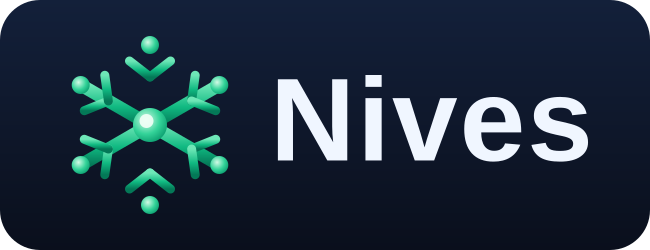

  

  
  
  

<em>An AI assistant for Home Assistant that remembers. One add-on, and the memory stays on your own machine.</em>

  

Talk to your home in plain language, by voice or text through HA Assist, and Nives recalls your preferences, routines, device nicknames, and sensor baselines across every conversation. No re-teaching, no re-explaining.

> Tell it once. *"100 ppm is normal for my NOx sensor"*, *"bedroom lights should go to 30% in the evening"*, *"call the WLED strip 'main kitchen light'"*. It still knows next time.

## Ask it why, not just what

  

One question, no hints about where to look. Nives pulled the day's VOC history, then went looking on its own: PM2.5, PM10, NOx, humidity, temperature and the bathroom fan automation, six histories in a single round. It ruled out sensor drift, moisture, the fan and the lights, ranked what was left, and named the downstairs kitchen because it remembered being told about that pattern before. Then it suggested how to confirm the theory.

Reading one sensor back to you is easy. Reasoning across all of them, over the whole day, is what you actually wanted when you asked.

## What you get

- **Reasons across your sensors, not just one.** Ask why the air got worse or whether the solar panels came out ahead today, and Nives fetches the histories it needs, compares them, and tells you what it ruled out and why. See [the VOC example](#ask-it-why-not-just-what) above.
- **Persistent memory.** Preferences, routines, sensor baselines, device nicknames. Survives restarts.
- **Forgets when you ask it to.** *"Forget that my canary word is bumblebee."* It quotes the exact memory back and waits for your yes before deleting anything.
- **Voice and text through Home Assistant Assist.** Any Assist pipeline works, satellites included. Spoken answers are written for the ear rather than the page, and when Nives ends on a question it asks Home Assistant to reopen the microphone, by the same rule HA's own agents use, so you can just answer.
- **It replies in your language.** Nives takes its default from your Assist pipeline, and the language you actually write in always wins. A house whose rooms and devices are named in one language but spoken to in another stays sorted out, and a one-word reply like "ok" or "tv" no longer flips it mid-conversation.
- **She is whoever you say she is.** One setting, **Custom Prompt**, replaces her personality outright. Nives is the default: a helpful, plain-spoken assistant who knows your house. Write your own and she becomes it. *"You are HAL 9000, the calm and precise computer from 2001"* is a two-line change, and yes, she will tell you she's afraid she can't do that. The name matters as much as the manner: she knows what she's called, so asking "who are you?" gets an answer rather than a shrug.
- **Knows your home.** Reads your floors, areas, and device capabilities, so it always knows which room a light is in and how to control it.
- **Creates and manages automations.** Just ask ("turn the porch light on at sunset", "make the evening scene 30 minutes earlier") and Nives builds, edits, lists, or removes Home Assistant automations for you, always confirming before it changes anything, and drawing on what it remembers about your home (your "evening", your preferred brightness). One request can produce several automations when that's what you actually asked for.
- **It warns you about the traps before you say yes.** An automation with no conditions will run regardless of who's home. A fixed-time trigger checks the temperature once at that moment and never looks again. An edit that would strip away every condition is worth a second look. Nives says all of this while you can still change your mind, and tells you which fields an edit leaves untouched.
- **Works inside your automations.** Nives is also a Home Assistant **AI Task** provider: call `ai_task.generate_data` from any automation to get an answer or structured data, reasoned with your home's context. It can even look at a **camera snapshot** and tell you what matters (with a vision-capable model), which makes for smarter, low-false-alarm camera and doorbell alerts.
- **Reachable from scripts and automations.** `conversation.process` works against the Nives agent without a conversation id, so a script or automation can hold a real back-and-forth, confirmations included.
- **It can do the listening too**, if you use a key from Nives Cloud. Optional, off by default. [See below](#using-it-by-voice).
- **It tells you before the balance runs out.** On a Nives Cloud key, Nives posts a Home Assistant notification when roughly three days of typical use are left, and a clearer one if it does run dry. Both clear themselves after a top-up. Keys you bring yourself are never watched.
- **Your memories are stored on your machine.** The memory database lives on your Home Assistant box, not ours, and there's no telemetry. (To answer you, Nives does send the *relevant* memories plus your home layout to the model with each request. The add-on docs spell out exactly what goes where. Want none of it to leave the house? Run a local model via Ollama.)
- **The add-on's own API is protected.** A token is generated on first start and kept on your machine, so nothing else running on your Home Assistant box can talk to your assistant, drive your devices through it, or wipe what it remembers.
- **Two ways to power it.** Managed **Nives Cloud**, or **bring your own key**. Both run the exact same on-device server and memory; only the AI endpoint differs.

## Teach it, then change your mind

Four separate conversations, in order. Nothing carries over between them except memory:

It quotes the exact stored memory back and does nothing until you confirm. It only ever forgets the one you name (*"don't forget to water the plants"* is still a reminder, not a deletion), and when several memories could match, it lists them and deletes nothing.

## Automations, described in a sentence

Notice what it tells you *before* building anything: this automation has no conditions, so it will run regardless of who is home. Nothing is written to your Home Assistant, and no memory is deleted, until you say yes. The confirmation is enforced by the server, not left to the model's good manners.

## Using it by voice

Nives works with whatever Assist pipeline you already have: a Voice PE puck, another satellite, the Home Assistant app, or simply typing. A spoken question gets a shorter answer built to be read aloud, and if Nives finishes on a question it asks Home Assistant to reopen the microphone for you, the same way HA's built-in agents do.

Speech-to-text happens *before* Nives ever sees your words, and it's where most voice frustration actually starts. Engines running on your own box are excellent at English on decent hardware, but on a small machine they struggle with names (poor "Nives" comes back as *News*, *Knives* or *Nieves*) and with languages other than English. Two things help:

- **Nives answers to its own name even when the microphone mangles it.** A request that opens with one of the common mishearings is understood as its name and answered normally, with no fuss made about it. Words in the middle of a sentence keep their ordinary meaning, so adding knives to the shopping list is still about knives.
- **Or you can let Nives do the listening.** With a key from Nives Cloud, switch **Transcription** on in the add-on's Cloud settings and restart. A couple of minutes later Nives appears as a **Speech-to-text** choice under Settings → Voice assistants, transcribing from the same balance your conversations already use. Listening is inexpensive next to thinking: a spoken command costs a small fraction of the reply it produces. Your pipeline's language is passed along, so a short command in your own language is understood rather than guessed at.

> **What that second one changes about your privacy, stated plainly.** With Transcription off, only your written request and your home's device list leave the house. With it on, the audio of what you say is sent to be transcribed as well. That is exactly why it stays off until you choose it. Turn it back off and Nives steps out of the Speech-to-text list on its own within a couple of minutes, handing your pipeline back to whichever engine it used before.

Would rather keep audio on your own hardware? Leave it off and use a local engine. Nives works exactly the same either way, it just receives the words instead of the sound. Speaking back to you is Home Assistant's own text-to-speech in both cases, whichever engine your pipeline uses, so nothing changes there.

## How it fits together

Everything that stores anything runs on your Home Assistant machine, in one container. The only thing that leaves is the request itself: what you said, the handful of memories relevant to it, and your home's layout. Your memory database never goes anywhere, and if you point Nives at Ollama on your own LAN, nothing leaves at all.

Two services share that container:

- **Nives server**, the conversation engine. Connects to Home Assistant automatically (no URL or token to configure) and controls your devices through HA's own tools.
- **Shodh Memory**, on-device cognitive memory with semantic search, so Nives surfaces the right context at the right moment. ([Shodh Memory](https://github.com/varun29ankuS/shodh-memory) is an independent open-source project. Nives integrates it, and the same engine powers home-mind.)

## Choosing how to power Nives

Nives needs a language model to do the thinking. You have two options, picked in the add-on's **Configuration** tab.

### Nives Cloud

One key, and choosing a model stops being your problem. We keep testing the field and run **the best model for the job, always current**, swapping it on our side when a better one turns up or ours gets retired, so the assistant improves without you installing or changing a thing.

It's also where the extras live, like optional transcription, because those need a model of their own picked and paid for per job rather than per conversation.

**New Cloud sign-ups are paused at the moment.** Existing keys keep working exactly as before, top-ups included. If you'd like to know when they reopen, write to hello@nives.house.

In the meantime **Bring Your Own Key** below is free, does everything the managed path does, and is the way to run Nives today.

### Bring Your Own Key (BYOK), for tinkerers

Prefer full control? Run Nives with **your own** provider key (Anthropic, OpenAI, OpenRouter, or a local Ollama endpoint) and pick your own model. Nothing to buy from us, ever.

A few honest notes so it goes smoothly:

- Your model **must support function / tool calling.** That's how Nives actually controls your home.
- Memory quality scales with the model: stronger models extract and recall facts more reliably.
- **Running it locally?** Give it room and a capable model. The system prompt plus tool definitions come to roughly 7,200 tokens before you've said a word, so a default 4k context window is already full. Use 8k or more. And small models tend to *narrate* tool calls rather than make them: we've watched llama3.1:8b cheerfully report turning on a light it never touched. Around 14B is where it starts behaving.
- **Repeat turns are cheaper than they look.** Your home's layout and device capabilities go out with every message, but they sit ahead of the parts that change each turn, so a provider that caches prompts reuses them instead of billing them again. On a mid-size home we measured repeat turns going from about a third of the prompt cached to around 99%.
- For a fully self-hosted, local-first setup, the open-source **[home-mind](https://github.com/hoornet/home-mind)** project (which Nives grew from) is purpose-built for exactly that.

## Install

You need Home Assistant OS or Supervised (the add-on store), on amd64 or aarch64. A Raspberry Pi 4/5 is fine. Running HA in bare Docker or Core, with no add-on store? Use [home-mind](https://github.com/hoornet/home-mind) instead; it's the same engine in Docker Compose form.

One click adds the repository to your Home Assistant:

Or manually:

1. In Home Assistant, open **Settings → Add-ons → Add-on Store**.
2. Click the **⋮** menu (top-right) → **Repositories**.
3. Add this URL: `https://github.com/hoornet/nives`
4. Find **Nives** in the store and click **Install**.
5. Open the **Configuration** tab, choose **Cloud** or **BYOK** (see above), enter your key, and **Save**.
6. **Start** the add-on.

Then point Home Assistant at it: **Settings → Voice assistants → (your assistant) → Conversation agent → Nives**. Now just talk to your home. Type in Assist, or speak if you've set up a voice pipeline.

## Nives or home-mind?

People regularly ask how Nives relates to **[home-mind](https://github.com/hoornet/home-mind)**, which is reasonable, since both come from the same author. Short version: **it's the same brain in a different box, and Nives has grown extra tools.**

Nives started as a fork of the home-mind server, so the core (the conversation engine and the memory layer) is shared heritage. Since then they've deliberately become two independent products aimed at two kinds of people:

- **home-mind** is the DIY path: Docker Compose, run the server and [Shodh Memory](https://github.com/varun29ankuS/shodh-memory) yourself, install the integration, wire it together. Full control, every choice yours, completely hands-on.
- **Nives** is the same stack as **one Home Assistant add-on**: one container, the companion integration installs itself, Supervisor auto-discovers it. Add repo, install, paste a key, done. In most cases you never need a terminal.

What has actually diverged:

| | home-mind | Nives |
|---|---|---|
| **Install** | Docker Compose + manual integration setup | One HA add-on, self-configuring |
| **HA tools** | 6 (read state, list/search entities, call services, history, forget a memory) | 11: those plus automation **create/list/update/delete** and service discovery, behind a server-enforced confirmation gate |
| **AI Task** | | `ai_task.generate_data` (text + structured output), usable inside your automations |
| **Vision** | | camera snapshots as input, so "is this expected?" on a doorbell frame |
| **Speech-to-text** | your pipeline's own engine | same, plus optional cloud transcription on a Nives Cloud key |
| **Voice satellites** | | sets `continue_conversation` after a question, so the satellite reopens the mic |
| **arm64 / Raspberry Pi** | official Shodh Docker image is amd64-only | add-on ships arm64 binaries, so it works on a Pi or arm64 HAOS out of the box |
| **Models** | BYOK: Anthropic / OpenAI / OpenRouter / Ollama | same BYOK, plus optional managed Nives Cloud |

Both are AGPL-3.0 with open repos, and both are maintained. **The assistant itself is never gated**: every memory, automation, and AI Task feature works the same on BYOK, and that path is free and never touches our servers. Cloud exists purely as the less-tinkering option. (The one Cloud-only extra is optional transcription, because it's billed from your balance; on BYOK you use Home Assistant's own speech-to-text, which is already there.) If you enjoy owning every moving part, home-mind is built for you; if you'd rather it just work, that's Nives.

## Beyond Home Assistant

**[Nives for Omarchy](https://github.com/hoornet/nives-omarchy)** puts the same conversation on your Linux desktop. Press a key, a small panel opens in the corner, ask by typing or by voice, and the answer is read back to you. It talks to Home Assistant's own conversation API, so it works with any Assist agent, and it's MIT-licensed and entirely separate from the add-on. It's at its best with Nives on the other end, since that's what gives it memory and automations, and whoever answers is set on the Home Assistant side, so the voice in that panel can be Nives, or HAL 9000, or anyone you care to describe.

## Coming from HomeMind PRO?

Nives is the same add-on under a new name, since v2.0.0: same memory layer, same Cloud and BYOK modes, same behaviour. The name is Slovenian, from the Latin *nives*, "snows". It's pronounced **NEE-ves**, and it's a good deal easier to say to a voice assistant than an acronym.

Switching over is a clean install rather than an update, because the add-on's underlying slug changed:

1. Install **Nives** from the same repository. It appears alongside your existing HomeMind PRO rather than replacing it.
2. Copy your configuration across (your key and any options).
3. Start Nives, check it answers, then uninstall HomeMind PRO.

Memories and conversation history don't carry over, so Nives starts fresh and learns you again. Your account and Cloud balance are unaffected.

The [v2.0.0 changelog](nives/CHANGELOG.md) has the full detail.

## Related projects

- **[home-mind](https://github.com/hoornet/home-mind)**, the open-source server Nives grew from (AGPL-3.0). An independent project; run it yourself if you prefer the fully-DIY path.
- **[Nives for Omarchy](https://github.com/hoornet/nives-omarchy)** (MIT), a desktop chat overlay for any Home Assistant Assist agent.
- **[Shodh Memory](https://github.com/varun29ankuS/shodh-memory)**, the cognitive memory engine powering both, by [@varun29ankuS](https://github.com/varun29ankuS). We integrate it, we didn't write it, and neither project would exist without it.

## Thanks

Nives is written by one person, but it hasn't been improved by one person. GitHub's contributors list counts merged commits only, so it will never show the people who have shaped this add-on most. They belong here instead.

- **[@pitzoid](https://github.com/pitzoid)** shaped the whole "just ask her to forget it" design in [#54](https://github.com/hoornet/nives/issues/54), stuck with it through several rounds, and found along the way that Nives could quietly learn its author's name as *yours* from an example in her own prompt. Also reported the double restart that looked exactly like Home Assistant crashing ([#50](https://github.com/hoornet/nives/issues/50)).
- **[@alcohen83](https://github.com/alcohen83)** pinpointed why automations and scripts couldn't hold a conversation with Nives at all ([#63](https://github.com/hoornet/nives/issues/63)), then spotted that a per-request timestamp sat in front of the cacheable part of the prompt ([#66](https://github.com/hoornet/nives/issues/66)). That second one made repeat turns dramatically cheaper for everybody.
- **[@Kristofer-KNE](https://github.com/Kristofer-KNE)** reported that bring-your-own-key was broken against OpenAI's newer models ([#60](https://github.com/hoornet/nives/issues/60)), and confirmed the fix.
- **[@cweld1332-eng](https://github.com/cweld1332-eng)** reported the Voice PE follow-up problem ([#25](https://github.com/hoornet/nives/issues/25)) with a control test against another agent that isolated the cause in one step.

If something ships because you reported it or built it, you get named here and in that release's changelog entry, unless you'd rather not be.

## Support & feedback

Nives is in early access and we'd genuinely love to hear from you.

- **Bugs / feature ideas:** open an [issue](https://github.com/hoornet/nives/issues).
- **Cloud or billing questions:** hello@nives.house.

## License

Nives, a Home Assistant add-on bundling a conversation server (a hard fork of [home-mind](https://github.com/hoornet/home-mind)) and Shodh Memory.
Copyright (c) 2026 Jure Sršen.

AGPL-3.0, see [LICENSE](LICENSE).
